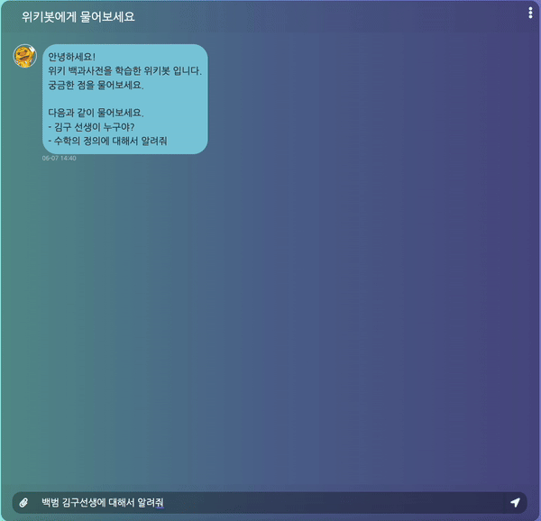

# RAG with wiki & langchain

## 0. 실행 확인 환경
- python 3.9
- mac
- library: requirements.txt

## 1. Make Wiki Dump
```
mkdir data

wget https://dumps.wikimedia.org/kowiki/latest/kowiki-latest-pages-articles.xml.bz2 \
    -O ./data/kowiki-latest-pages-articles.xml.bz2

python -m wikiextractor.WikiExtractor \
    --json \
    --out ./data/kowiki \
    ./data/kowiki-latest-pages-articles.xml.bz2

python src/wiki/make_wiki_dump.py \
    --n_file 100
```

## 2. Make context embedding index
```
python src/vdb/make_vdb_index.py
```

## 3. RUN rag server
```
python src/app/server.py \
    --hf_token <huggingface_access_token>
```

## 4. Test RAG
- Test with langservep playground
    - http://127.0.0.1:18080/question/playground
- Test with chat UI
    - http://127.0.0.1:18080

## 5. Demo

